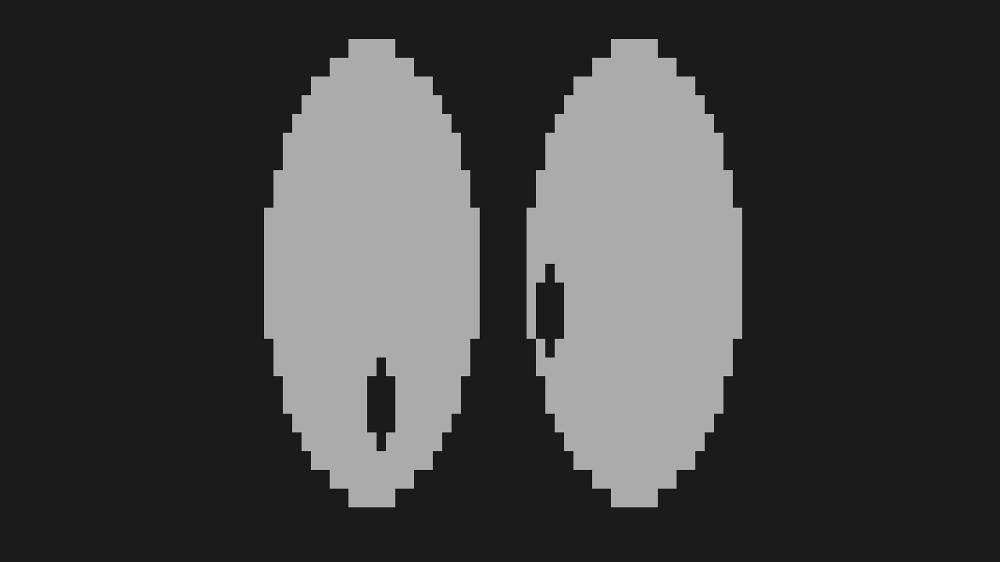

==========
cursedeyes
==========

*Like Xeyes, but for terminal.*

.. contents:: **Contents**
   :local:

Installation
============

Requirments
-----------

* C99 and POSIX.1-2008 supported compiler
* POSIX-compliant system
* ncurses
* ``TERM=xterm-1003`` or with ``XM=\E[?1003%?%p1%{1}%=%th%el%;`` capability.

Steps
-----

Simply do the following to install under ``/usr/local``,

.. code:: bash

  make install

Or you can use ``PREFIX`` to choose the installation location, for example

.. code:: bash

  make PREFIX=$HOME/.local 

To uninstall, use ``uninstall`` target.

Copyright
=========

The contents in this repository have been place in the public domain, or via
UNLICENSE_.

.. _Unlicense: UNLICENSE
